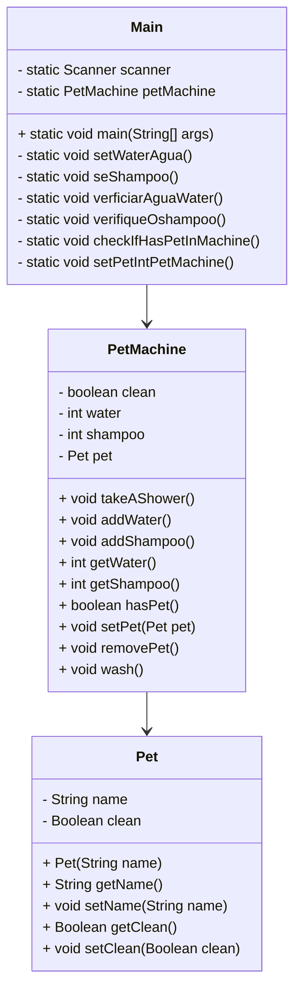

```mermaid
classDiagram
    class Main {
        - static Scanner scanner
        - static PetMachine petMachine
        + static void main(String[] args)
        - static void setWaterAgua()
        - static void seShampoo()
        - static void verficiarAguaWater()
        - static void verifiqueOshampoo()
        - static void checkIfHasPetInMachine()
        - static void setPetIntPetMachine()
    }

    class Pet {
        - String name
        - Boolean clean
        + Pet(String name)
        + String getName()
        + void setName(String name)
        + Boolean getClean()
        + void setClean(Boolean clean)
    }

    class PetMachine {
        - boolean clean
        - int water
        - int shampoo
        - Pet pet
        + void takeAShower()
        + void addWater()
        + void addShampoo()
        + int getWater()
        + int getShampoo()
        + boolean hasPet()
        + void setPet(Pet pet)
        + void removePet()
        + void wash()
    }

    Main --> PetMachine
    PetMachine --> Pet
```
